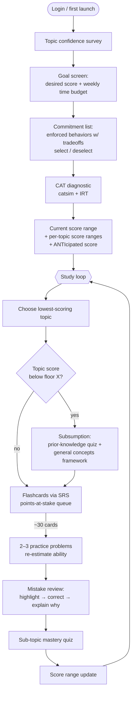

# Ankidote — PRD

**Product:** Ankidote — a redesign of Anki built specifically for GMAT preparation.
**Tagline:** The antidote to unstructured studying.
**Status:** Draft v1
**Base:** Fork of Anki (Svelte/TS frontend → PyQt GUI → pylib → rslib, protobuf IPC)

---

## 1. Overview

### 1.1 User persona

A student studying for the GMAT who wants **one tool** that takes them from "I don't
know where I stand" to "I hit my target score" — without juggling an error log
spreadsheet, a flashcard app, a question bank, and a practice-test site.

### 1.2 Core uniqueness

1. **CAT-driven targeting.** Ankidote simulates the GMAT's computerized adaptive
   test (CAT) using Item Response Theory to estimate the student's ability per
   topic, then serves _only the most score-moving material_: the flashcards and
   practice problems with the highest expected impact on their score range.
2. **Explicit tradeoffs everywhere.** The GMAT is a game with a score; studying is
   a game with a time budget. Every piece of friction the app adds (mistake
   review, answer-choice ranking, note-taking) is presented with its research-backed
   cost/benefit: _"this costs you +X min/day, and buys you ~Y points / Z% faster
   mastery."_ The student always chooses — but chooses informed.

### 1.3 Key philosophy

> **Never add friction silently. Present the exact tradeoff to the learner every
> time you make the learning process harder for a better long-term game.**

Learning science is full of "desirable difficulties" (Bjork & Bjork, 2011) that
feel worse in the moment but produce durable learning — retrieval practice,
spacing, interleaving, error analysis. Students abandon them because the cost is
felt immediately and the benefit is invisible. Ankidote's job is to make the
benefit visible and let the student trade time for points deliberately. Every
tradeoff shown in the UI is backed by a citation (see §8, Research appendix).

---

## 2. User flow (end to end)



---

## 3. Onboarding

### 3.1 Topic confidence survey

Immediately after login, a quick survey (< 2 min) covering the full GMAT topic
tree — Quant (arithmetic, algebra, number properties, word problems, rates/work,
statistics, combinatorics/probability), Verbal (critical reasoning, reading
comprehension), Data Insights (data sufficiency, multi-source reasoning, table
analysis, graphics interpretation, two-part analysis).

- For each topic: a 1–5 confidence slider ("Never seen it" → "Could teach it").
- Purpose: (a) initialize the CAT diagnostic's prior for ability estimation
  (warm-start `catsim`'s initializer instead of a random θ), (b) calibrate the
  gap between _confidence_ and _measured ability_ later — this gap is itself a
  metric we surface, since learners are systematically overconfident in how much
  they've absorbed (Dunlosky & Rawson, 2012; Kruger & Dunning, 1999).
- Survey answers are never treated as ground truth — the diagnostic is.

### 3.2 Goal screen: desired score × time budget

One screen, two inputs:

| Input                | Format                                                     |
| -------------------- | ---------------------------------------------------------- |
| Desired score        | GMAT total score (205–805) with a slider; shows percentile |
| Time I want to spend | Hours/week + target test date                              |

The app then computes (from the diagnostic prior + workload simulation, similar
to Anki's existing FSRS workload simulator) a **commitment plan**: the set of
behaviors it will enforce to reach that score in that time.

### 3.3 Commitment list (the core tradeoff screen)

The app presents the list of behaviors it will _enforce_. Every item is a
toggle. **Deselecting an item does not lower the target — it increases the
estimated time (or lowers the ANTIcipated score), and the screen re-computes
live.** This is the philosophy made concrete: friction is opt-out, but opting
out has a visible price.

Required items in v1 (each shows its research-backed tradeoff inline):

| Commitment                    | What it enforces                                                                                                  | Tradeoff shown to user (illustrative)                                                                                               |
| ----------------------------- | ----------------------------------------------------------------------------------------------------------------- | ----------------------------------------------------------------------------------------------------------------------------------- |
| **Mistake review**            | After every problem set, you must walk through each miss: highlight where you went wrong, correct it, explain why | "+6 min per session → errors corrected with feedback are the single strongest predictor of not repeating them (Metcalfe 2017)"      |
| **Flashcards per day**        | Daily SRS quota (points-at-stake queue, §5.3)                                                                     | "N cards/day ≈ M min/day → spaced retrieval roughly doubles long-term retention vs. restudy (Roediger & Karpicke 2006)"             |
| **Practice problems per day** | Daily IRT-selected problem quota                                                                                  | "K problems/day → keeps your ability estimate fresh; without it your score range widens and targeting degrades"                     |
| **Answer choice ranking**     | On multiple-choice items, rank all 5 choices instead of picking one                                               | "+20s per question → forces discrimination between distractors; exposes _why_ wrong answers are tempting, feeding mistake taxonomy" |
| Diagnostic check-ins          | Periodic mini-CAT to re-anchor the score range                                                                    | "+25 min/week → score estimate stays honest; skipping it means your ANTIcipated score is a guess"                                   |
| Explain (self-explanation)    | Type/say a one-line "why" on flagged cards                                                                        | "+15s per card → self-explanation reliably improves transfer (Chi et al. 1994)"                                                     |
| Organize                      | Weekly prompt to reorganize your notes/error log into your own structure                                          | "+10 min/week → organizing and transforming material is a top self-regulated-learner behavior (Zimmerman & Martinez-Pons 1986)"     |
| Note-to-self                  | Leave yourself a tip on any card you miss twice                                                                   | "+10s per lapse → your future self reads it right before the next attempt"                                                          |

Deselect example: turning off **mistake review** immediately re-renders:
_"Estimated study time to 655: 9.5 hrs/week → 12 hrs/week (+2.5)"_ — because the
model assumes lower learning efficiency per problem without error analysis.

**Penalty/difficulty buttons.** The student also chooses enforcement strictness
per commitment (Soft: reminder → Standard: blocks next queue → Hard:
self-consequating, e.g. adds cards to tomorrow's quota on skip). Each level
shows its time tradeoff. Self-imposed contingencies ("self-consequating") are a
documented strategy of high-achieving self-regulated learners (Zimmerman &
Martinez-Pons, 1986); the app makes them one tap.

---

## 4. Diagnostic

### 4.1 CAT simulation with `catsim`

The diagnostic is a computerized adaptive test built on the
[`catsim`](https://douglasrizzo.com.br/catsim/) Python package (item selection,
ability estimation, and stopping criteria over logistic IRT models):

- **Item bank:** GMAT-style items pre-calibrated with 2PL/3PL IRT parameters
  (discrimination _a_, difficulty _b_, guessing _c_). `catsim` does not estimate
  item parameters; calibration is an offline pipeline (e.g. `girth` / `py-irt`
  or R `mirt`) — see §7.4.
- **Initialization:** prior θ per topic seeded from the confidence survey.
- **Selection:** maximum-information selector — each next question is the one
  that most reduces uncertainty about the student's ability.
- **Estimation:** numerical search estimator updates θ after every response.
- **Stopping:** minimum standard-error stopper with an item cap, so the
  diagnostic is as short as the student's consistency allows (~30–45 min).

### 4.2 Answer choice ranking (in diagnostic and drills)

Where enabled, the student ranks all five choices from most to least likely
instead of picking one. This yields far richer signal than a binary
correct/incorrect: partial knowledge, which distractor families fool this
student, and confidence calibration. The ranking data feeds the mistake
taxonomy (§5.4) and the per-topic weakness vector (§5.3).

### 4.3 Output: score ranges, not points

- **Current score range** — total GMAT estimate with a confidence band
  (θ ± SE mapped to the score scale). Always shown as a _range_; the band
  narrows as evidence accumulates, which itself teaches the student that
  certainty is earned.
- **Per-topic score range** — same treatment per topic; drives topic selection
  in the loop.
- **ANTIcipated score** — the projected score range on test day _if the student
  keeps their current commitment plan and pace_. Recomputed continuously. This
  is the single number the whole app is accountable to: every commitment
  toggle, every skipped session, every mastered sub-topic visibly moves it.

---

## 5. The study loop (Anki loop, modified)

The classic Anki loop is _deck → due cards → answer → schedule_. Ankidote wraps
it in a score-driven outer loop:

### 5.1 Topic selection

`LOOP { choose lowest-scoring topic }` — the topic whose score range (weighted
by its GMAT section weight) is furthest below target. Interleaving of
sub-topics happens _within_ the session (§5.6), but topic focus is deliberate:
one weak topic at a time.

### 5.2 Subsumption gate (topic score below floor X)

If the topic's estimated score is below a floor X — i.e., the student lacks the
foundation for card-level drilling to stick — the loop first runs a
**subsumption phase** (Ausubel: new material is retained when it can be
subsumed under existing cognitive structure):

1. **Activate prior knowledge with a quiz** — a short _pre-cards quiz_ on the
   topic's core concepts, before any instruction. Getting these wrong is
   expected and fine: pretesting improves subsequent learning even when the
   answers are wrong (prequestion effect, meta-analytic g ≈ 0.54, Pan et al.
   2023; St. Hilaire et al. 2023).
2. **Provide the framework** — a one-screen _general concepts framework_ for
   the topic (an advance organizer): the topic's structure, key rules, and how
   sub-topics relate. New cards then hang off this scaffold instead of floating
   free.

The pre-cards quiz results also seed the **points-at-stake queue** for that
topic: what you couldn't answer is exactly what's at stake.

### 5.3 Flashcards → SRS with the points-at-stake queue

Cards are scheduled by Anki's existing SRS (FSRS), but _ordered_ by a new
review order: the **points-at-stake queue**.

> **Points-at-stake queue:** sorts due cards by
> `topic_weight × student_weakness` — how much this topic is worth on the GMAT,
> times how weak the student currently is on it — so the highest-expected-value
> cards always come first. When time is short, the student burns their minutes
> where the points are.

- `topic_weight`: derived from the topic's contribution to the section score
  and the section's contribution to total score.
- `student_weakness`: derived from the per-topic θ estimate and its distance
  from the target, refreshed on every quiz/problem/diagnostic update.
- Implementation: **a new protobuf message and review-order enum variant in the
  Rust scheduler, invoked from Python** (see §7.2).

### 5.4 Flashcard interaction: highlight → correct → explain why

On a miss, the card flips into mistake mode:

- **Highlight** — the app highlights (or the student marks) the exact step or
  fact where the reasoning broke.
- **Correct** — the student produces the corrected step, not just reads it.
- **Explain why** — one line on _why_ the error happened (concept gap, misread,
  arithmetic slip, distractor trap). Errorful learning is only productive with
  corrective feedback that includes the reasoning behind the mistake
  (Metcalfe 2017); errors held with high confidence are the _most_ correctable
  (hypercorrection effect) — so high-confidence misses get priority treatment.

Explanations are tagged into a **mistake taxonomy** that feeds sub-topic
mastery tracking and generates targeted "mistake review" cards.

### 5.5 Estimate-adjustment problems: 2–3 problems per ~30 cards

After roughly 30 flashcards, the loop injects **2–3 IRT-selected practice
problems** on the same topic. Purpose:

1. Re-estimate topic θ with real problem-solving evidence (cards measure
   recall; problems measure application).
2. Update the score range and ANTIcipated score in near-real-time, so the
   student sees cards translating into points.
3. Feed misses into mistake review and the points-at-stake weights.

### 5.6 Interleaving — bounded on purpose

Sub-topics _are_ interleaved within a session (mixing related-but-distinct
problem types forces discrimination — the classic interleaving benefit). But
interleaving is **deliberately capped**: as Carl Hendrick summarizes the
research, interleaving follows an inverted U-curve — pushed past a threshold
(too many topics, excessive switching, insufficient prior knowledge) the
cognitive load reverses the benefit. Rules:

- Interleave only **sub-topics within the active topic** (e.g. rates vs. work
  vs. mixtures), never across sections mid-session.
- No interleaving during the subsumption phase — blocked practice until the
  learner clears the foundation floor X (interleaving works best after basic
  competency; blocking is better for initial rule abstraction).
- Interleaving intensity scales with demonstrated sub-topic mastery.

### 5.7 Quiz → score update

Each loop iteration ends with a short **sub-topic mastery quiz**. Results
update: per-topic score range → total score range → ANTIcipated score →
points-at-stake weights → next topic selection. The loop repeats with the new
lowest-scoring topic.

---

## 6. Behavioral enforcement features

Derived from the self-regulated learning literature (Zimmerman &
Martinez-Pons' categories: self-evaluation, organizing & transforming, seeking
information, keeping records, environmental structuring, self-consequating,
rehearsing, seeking assistance) and from observed learner failure modes
("solved it, hit run, moved on"; "didn't gather info before starting"; "started
studying too late"; "overconfident, skipped notes, had to relearn").

Every feature below follows the philosophy: **friction is announced with its
exact tradeoff, and the student can decline it at a visible cost.**

### 6.1 Self-evaluation prompts

Short periodic check-ins (end of session, 1 tap each):

- _"How distracted were you this session?"_ (1–5)
- _"Did you review your answers for mistakes?"_ (yes/no — cross-checked against
  actual behavior, and the discrepancy is shown, not hidden)

These calibrate the student's self-assessment against logged behavior. The
confidence-vs-ability gap from onboarding (§3.1) is re-surfaced here.

### 6.2 Automatic mistake-behavior prompting

Beyond self-report, the app _encourages the behavior directly_: after any
problem answered quickly and incorrectly, auto-prompt mistake highlighting
before the next item unlocks (at the strictness level the student chose in
§3.3). This targets the "just hit run" anti-pattern: checking work is enforced
at the moment it matters, not preached.

### 6.3 Organize & note-to-self

- Weekly **organize** prompt: restructure your error log / notes for a topic
  into your own words and grouping (organizing-and-transforming is among the
  strategies most associated with high achievers).
- **Notes and tips to self:** on any card missed twice, the student writes a
  one-line tip; it is displayed the instant before their next attempt on that
  card. Combats "overconfidence in absorption → no notes → relearn."

### 6.4 Fact interrogation (elaborative interrogation)

The app periodically **interrogates the student about a fact** they've marked
as mastered: _"Why is the standard deviation unchanged when you add a constant
to every value?"_ Free-text answer, self-graded against a model answer.
Elaborative interrogation ("why is this true?") has moderate evidence for
durable learning (Dunlosky et al. 2013) and doubles as a mastery audit —
mastered cards that fail interrogation drop back into the queue.

### 6.5 Scheduling enforcement

At onboarding the student set hours/week and a test date. The app builds a
session schedule backwards from test day and treats it as a commitment with
the same tradeoff mechanics: skipping a session immediately moves the
ANTIcipated score band, on screen. This targets the "start studying much
earlier than feels necessary" failure mode — the cost of procrastination is
rendered in points _today_, not discovered in week 8.

---

## 7. Technical requirements

Ankidote is a fork of Anki; we keep the four-layer architecture
(`ts/` Svelte frontend, `qt/aqt/` PyQt shell, `pylib/anki/` Python library,
`rslib/` Rust core, `proto/anki/` contracts).

### 7.1 What we reuse

- **SRS scheduling:** FSRS in `rslib/src/scheduler/` unchanged for card
  intervals; only the _ordering_ of due cards changes.
- **Card/note/deck storage**, review log, sync, and the reviewer UI shell
  (`qt/aqt/reviewer.py` + `ts/reviewer/`).
- **Workload simulation** patterns from `simulateFsrsWorkload` as the basis for
  the commitment-list time estimates.

### 7.2 Points-at-stake queue (new backend work)

- **New protobuf message** in `proto/anki/scheduler.proto` (or
  `deck_config.proto`), e.g.:

```proto
message PointsAtStakeOrder {
  // topic id -> weight of the topic toward the target score
  map<string, float> topic_weights = 1;
  // topic id -> current weakness (distance from target theta), 0..1
  map<string, float> student_weakness = 2;
}
```

plus a new review-order variant so the queue builder
(`rslib/src/scheduler/queue/`) can sort due cards by
`topic_weight × student_weakness` (descending).

- **Rust:** implement the ordering in the queue-building code; expose an RPC in
  `rslib/src/scheduler/service/`.
- **Python:** the CAT/IRT engine (which owns θ estimates) computes the weight
  vectors and **calls the new RPC from Python** via the generated
  `_backend_generated.py` method after each score update.
- Full build (`just check`) required after the `.proto` change.

### 7.3 CAT/IRT engine (Python)

- `catsim` (pip) inside `pylib`/`qt` layer: initializer (survey-seeded),
  max-information selector, numerical-search estimator, min-SE stopper.
- Runs the onboarding diagnostic, the periodic mini-CATs, the 2–3
  estimate-adjustment problems (§5.5), and sub-topic quizzes — all one engine
  with different stopping rules.
- Maintains per-topic θ and SE; maps θ → GMAT score ranges via a calibration
  table.

### 7.4 Item bank & calibration (offline pipeline)

- GMAT-style items authored/ingested with topic + sub-topic tags.
- IRT parameter calibration offline (`girth`, `py-irt`, or R `mirt` —
  `catsim` intentionally does not do calibration); parameters shipped with the
  item bank and refined as response data accumulates.

### 7.5 New frontend surfaces (Svelte, `ts/routes/`)

| Screen                                                 | Route (proposed)              |
| ------------------------------------------------------ | ----------------------------- |
| Topic confidence survey                                | `/ankidote/survey`            |
| Goal + commitment list (live tradeoff recompute)       | `/ankidote/goal`              |
| Diagnostic runner (CAT, answer-choice ranking UI)      | `/ankidote/diagnostic`        |
| Score dashboard (ranges, ANTIcipated score, per-topic) | `/ankidote/score`             |
| Mistake review flow (highlight → correct → explain)    | `/ankidote/mistakes`          |
| Subsumption framework pages                            | `/ankidote/framework/{topic}` |

### 7.6 Data model additions

- Topic tree (GMAT taxonomy) with section weights.
- Per-topic θ/SE history; score-range snapshots (for the ANTIcipated score
  trend line).
- Mistake taxonomy records (error type, confidence at time of error,
  explanation text).
- Commitment plan + strictness levels + adherence log.
- Self-evaluation responses; notes-to-self attached to cards.

---

## 8. Research appendix — the tradeoffs, sourced

Per the key philosophy, every enforced behavior maps to research. This table is
the canonical source for the tradeoff copy shown in the UI.

| App mechanic                                                              | Research basis                                                                                                                                                          | Key sources                                                                                                                                          |
| ------------------------------------------------------------------------- | ----------------------------------------------------------------------------------------------------------------------------------------------------------------------- | ---------------------------------------------------------------------------------------------------------------------------------------------------- |
| Mistake review (highlight/correct/explain)                                | Errorful learning + corrective feedback incl. reasoning analysis beats error avoidance; interactive engagement with _why_ the error happened drives the gain            | Metcalfe, _Learning from Errors_, Annu. Rev. Psychol. 2017; Metcalfe et al. 2024 (Algebra Regents LFE study)                                         |
| Prioritizing high-confidence errors                                       | Hypercorrection effect: high-confidence errors are corrected more readily and durably                                                                                   | Butterfield & Metcalfe 2001; Metcalfe & Miele 2014                                                                                                   |
| Flashcards per day (SRS)                                                  | Retrieval practice roughly doubles delayed retention vs. restudy; spacing beats massing                                                                                 | Roediger & Karpicke 2006; Cepeda et al. 2006                                                                                                         |
| Pre-cards quiz (subsumption)                                              | Prequestion/pretesting effect: attempting answers before learning improves retention even when wrong (meta-analytic g ≈ 0.54 on tested material)                        | St. Hilaire, Carpenter et al. 2023 (meta-analysis); Pan et al. 2023 (Ed. Psych. Review)                                                              |
| General concepts framework                                                | Advance organizers / subsumption: new material is retained when anchored to existing cognitive structure                                                                | Ausubel 1960, 1968                                                                                                                                   |
| Bounded interleaving                                                      | Interleaving benefits follow an inverted U-curve; excess switching or insufficient prior knowledge reverses the benefit; block first, interleave after basic competency | Hendrick, _Interleaving: a short guide_ (synthesis); Rohrer & Taylor 2007; Little et al. 2025 / Behav. Sci. 15:662 (strategy × sequence interaction) |
| Answer choice ranking                                                     | Forced discrimination among distractors; richer diagnostic signal than binary scoring; supports discrimination learning analogous to interleaving's mechanism           | Little & Bjork 2015 (MC questions as retrieval w/ competitive alternatives)                                                                          |
| Explain why / fact interrogation                                          | Self-explanation and elaborative interrogation show reliable (moderate) benefits for comprehension and transfer                                                         | Chi et al. 1994; Dunlosky et al. 2013 (Psych. Sci. Public Interest)                                                                                  |
| Self-evaluation prompts, notes, organizing, self-consequating, scheduling | Behaviors of high-achieving self-regulated learners: self-evaluation, organizing & transforming, record-keeping, self-consequences, planning                            | Zimmerman & Martinez-Pons 1986; Zimmerman 2002                                                                                                       |
| Surfacing confidence-vs-ability gap                                       | Learners' judgments of learning are systematically overconfident, causing premature dropping of material                                                                | Dunlosky & Rawson 2012; Kruger & Dunning 1999                                                                                                        |
| Friction framed as informed choice                                        | Desirable difficulties improve retention but are subjectively aversive; learners misjudge them, so the benefit must be made visible                                     | Bjork & Bjork 2011; Kirk-Johnson et al. 2019 (effort misattribution)                                                                                 |
| CAT diagnostic                                                            | Adaptive testing via IRT yields precise ability estimates with fewer items; `catsim` provides initializer/selector/estimator/stopper components                         | Meneghetti & Aquino 2017 (catsim paper, arXiv:1707.03012); Lord 1980                                                                                 |

**Open research tasks before GA copy is finalized:**

- Quantify the time-cost numbers per commitment from our own telemetry (the
  UI's "+X min → +Y points" claims must come from Ankidote data, with the
  citations as the mechanism justification, not the magnitude).
- Determine the interleaving cap (sub-topics per session) empirically via A/B —
  literature says "inverted U" but not where the peak is for GMAT material.
- Validate the θ → GMAT score-range mapping against real score reports.

---

## 9. Success metrics

| Metric                                              | Target                                                          |
| --------------------------------------------------- | --------------------------------------------------------------- |
| Diagnostic completion rate after onboarding         | > 85%                                                           |
| Score-range narrowing (SE reduction) per study hour | trending down weekly                                            |
| ANTIcipated score vs. actual reported GMAT score    | within the stated range for ≥ 80% of test-takers                |
| Commitment adherence (sessions kept / scheduled)    | > 70% at week 4                                                 |
| Mistake-review completion on missed problems        | > 90% (it's enforced — measures how often users pay to opt out) |
| Relearn rate (cards mastered → lapsed → relearned)  | decreasing vs. stock-Anki baseline                              |

## 10. Out of scope (v1)

- Essay (AWA-style) scoring, tutoring chat, and content authoring tools.
- Mobile clients (desktop-first, same as Anki).
- Multi-exam generalization (GRE/LSAT) — the architecture should not preclude
  it (topic tree + item bank are data, not code), but v1 ships GMAT only.
