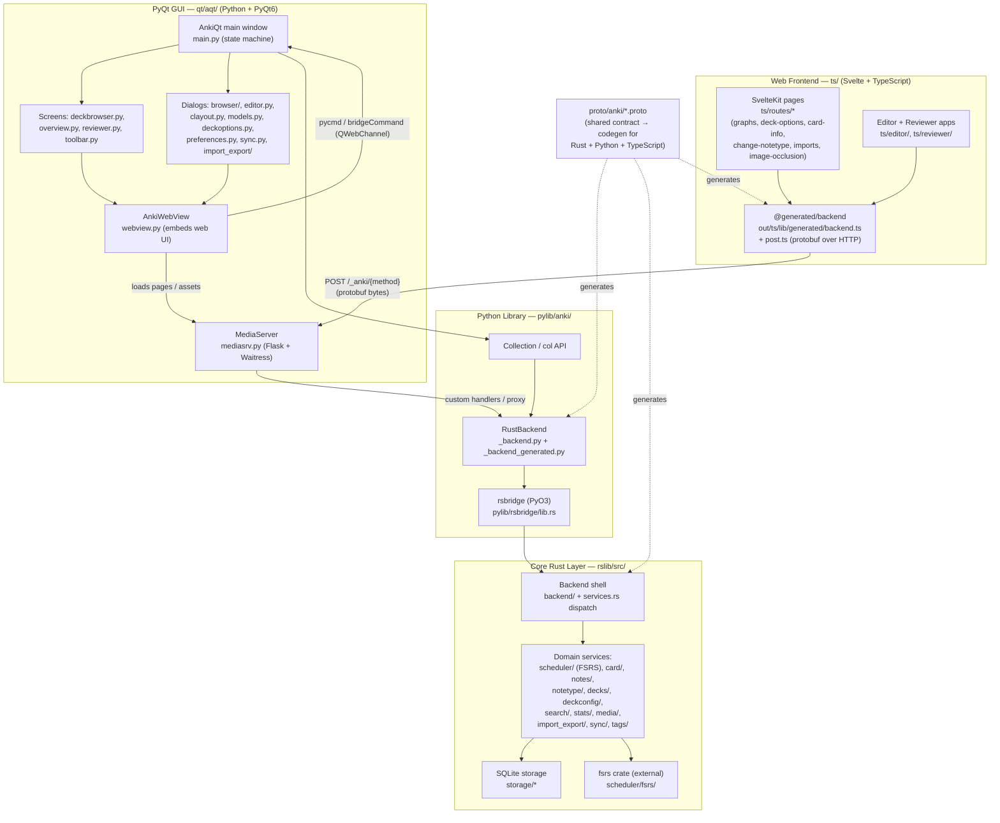
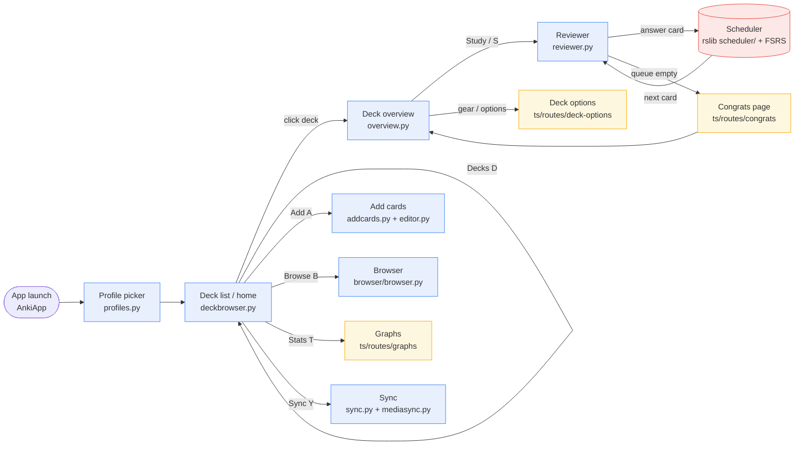
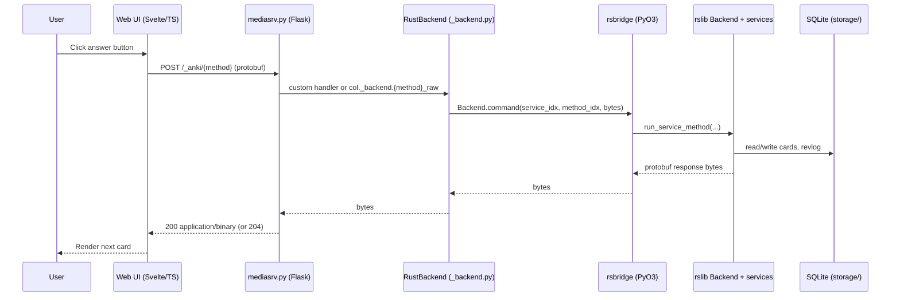

# Anki Architecture & Flow Diagrams

These diagrams capture the current tech stack and the basic request/data flow
across Anki's four layers (Svelte/TS frontend → PyQt GUI → Python lib → Rust
core), plus the protobuf-based IPC that ties them together.

## 1. Tech stack & layered architecture

## 2. Study flow (user journey) & state machine

## 3. A backend RPC round-trip (e.g. answering a card)

